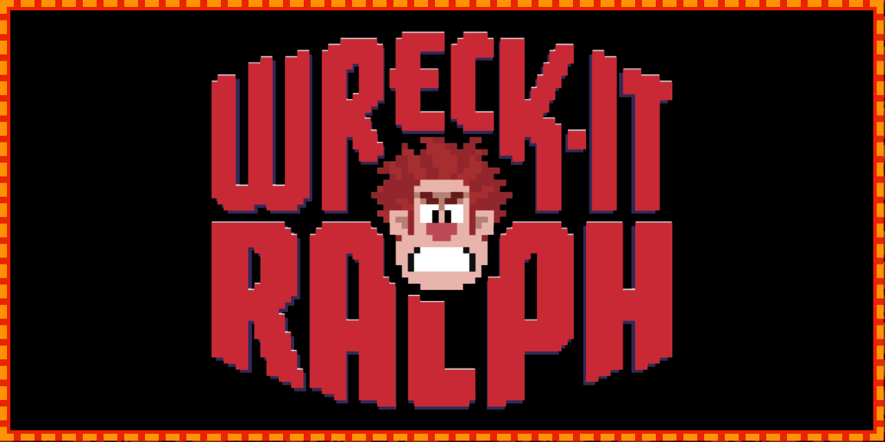
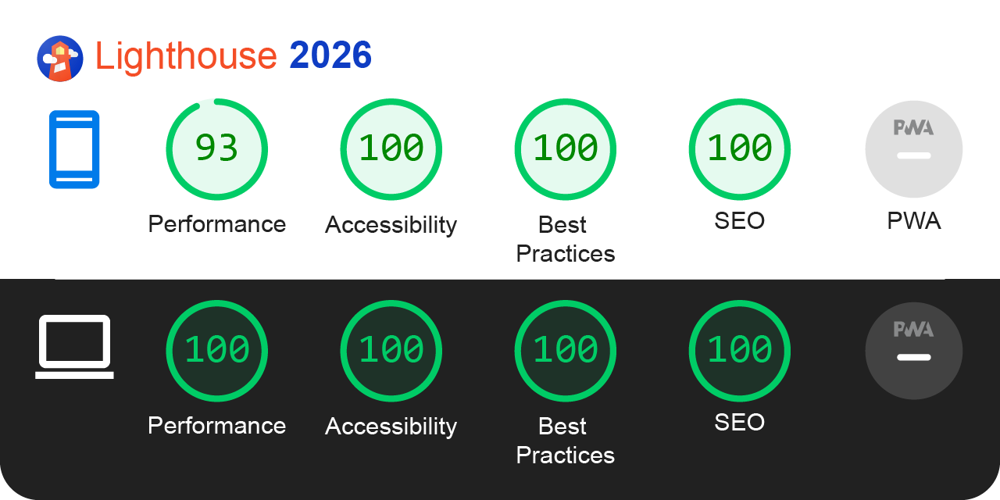

<h1 align="center"> 🎮 Detona Ralph 🧱 </h1>


## 📑 Table of Contents

- [📑 Table of Contents](#-table-of-contents)
- [📖 Overview](#-overview)
- [🛠️ Technologies](#-technologies)
- [⚡ Performance & PWA](#-performance--pwa)
- [🚀 Demo](#-demo)
- [📦 Install and Use](#-install-and-use)
- [📂 File Structure](#-file-structure)
- [🎨 Reference & Inspiration](#-reference--inspiration)
- [👨‍💻 Author and Contact](#%E2%80%8D-author-and-contact)

## 📖 Overview

**Wreck-It Ralph - Whack-a-Mole** is an interactive, fast-paced web game inspired by the classic arcade experience. Built with a strong focus on DOM manipulation and state management, this project brings the 8-bit dynamic world of Wreck-It Ralph directly to the browser. 

Players are challenged to test their reflexes by "whacking" the target character as it randomly spawns across a grid within a strict time limit.

## 🛠 Technologies

The following technologies were used to build this project:

- [HTML5](https://developer.mozilla.org/en-US/docs/Web/HTML)
- [CSS3](https://developer.mozilla.org/en-US/docs/Web/CSS)
- [Javascript](https://developer.mozilla.org/en-US/docs/Web/JavaScript)

## ⚡ Performance & PWA



## 🚀 Demo

Access the live application below to interact with the interface and run your own performance tests.

Detona Ralph: [https://detona-ralph-two.vercel.app/](https://detona-ralph-two.vercel.app/)

### Desktop

[desktop.webm]https://github.com/Epiled/detona-ralph/assets/55258483/251b9056-57d8-417f-9de1-d43a6afd5816

### Mobile

Coming Soon!

## 📦 Install and Use

**Prerequisites:** Node.js (v22.x) or higher installed.

1. Clone the repository:
```bash
git clone https://github.com/Epiled/detona-ralph.git
cd detona-ralph
```

2. Install the dependencies:
```bash
npm install
```

3. Run the development environment (Build + Watch + Server):
```bash
npm run dev
```

## 📂 File Structure

Below is the project architecture. All development should be done inside the src/ folder.

```text
detona-ralph/
├── src/                # Main source code
│   ├── assets/         # Game sprites, audio files, and background images
│   ├── db/             # Local mock data or level configuration JSONs
│   ├── scripts/        # Core game logic, state management, and DOM manipulation
│   ├── styles/         # Global styles, animations, and theme definitions
├── index.html          # Main game entry point
└── package.json        # Project dependencies and automation scripts
```

## 🎨 Reference & Inspiration

This project was developed as a practical challenge during the **[Bootcamp Potência Tech iFood - Programação do Zero](https://www.dio.me/bootcamp/potencia-tech-ifood-programacao-do-zero)**, hosted by DIO (Digital Innovation One). 

The core game mechanics, grid structure, and initial logic concepts were inspired by the educational materials provided throughout the course, serving as a foundation to apply advanced DOM manipulation and Vanilla JavaScript state management.

## 👨‍💻 Author and Contact

<a href="https://github.com/Epiled">
  
  <br />
  <sub><b>Felipe De Andrade</b></sub>
</a>

Made with ❤️ by Felipe De Andrade 👋🏽 Get in touch!

[](https://www.linkedin.com/in/fademendonca/)
[](https://codepen.io/epiled)
[](mailto:felipe.deam98@gmail.com)
